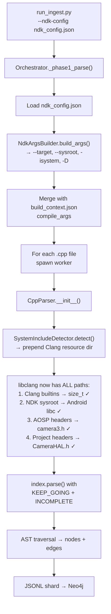

# How NDK Config Solves "Failed to Parse Translation Unit"

## The Problem (Before)

When you ran `python scripts/run_ingest.py --source-root /path/to/camera_hal`, libclang tried to parse your `.cpp` files but:

1. **No system headers** → `#include <stddef.h>` fails → `size_t` is unknown → **fatal error**
2. **No NDK sysroot** → `#include <stdint.h>` fails → `int32_t` unknown → **fatal error**
3. **No AOSP headers** → `#include <hardware/camera3.h>` fails → **fatal error**
4. **Parser aborts on first fatal** → entire file produces **zero data** → `"Failed to parse Translation Unit"`

---

## The Fix — 3 Layers Working Together

### Layer 1: `SystemIncludeDetector` — Fixes `size_t`, `float_t`, `int32_t`

This runs automatically (no config needed). When `CppParser` is created:

```
CppParser.__init__(auto_system_includes=True)
        │
        ▼
SystemIncludeDetector.detect()
        │
        ├─ Runs: clang -print-resource-dir
        │        → Returns: /usr/lib/clang/18
        │        → Checks: /usr/lib/clang/18/include/stddef.h exists? ✓
        │
        ▼
Prepends to compile_args:
  ["-isystem", "/usr/lib/clang/18/include"]
```

**This single directory contains all the built-in Clang headers:**

| Header | Types it provides |
|--------|-------------------|
| `stddef.h` | `size_t`, `ptrdiff_t`, `NULL` |
| `stdint.h` | `int32_t`, `uint64_t`, `int8_t` |
| `float.h` | `float_t`, `double_t`, `FLT_MAX` |
| `stdarg.h` | `va_list`, `va_start` |
| `limits.h` | `INT_MAX`, `UINT_MAX` |

> [!IMPORTANT]
> **This layer alone fixes your `size_t` / `int32_t` / `float_t` errors** — even without an NDK config. The types come from Clang's own built-in headers that libclang couldn't find before.

---

### Layer 2: `NdkArgsBuilder` — Fixes Android-Specific Headers

When you provide `--ndk-config configs/ndk_config.json`:

```json
{
    "ndk_root": "/home/dev/Android/Sdk/ndk/27.0.12077973",
    "api_level": 29,
    "target_arch": "aarch64",
    "extra_system_includes": [
        "/path/to/aosp/hardware/libhardware/include",
        "/path/to/aosp/system/media/camera/include"
    ],
    "defines": ["ANDROID"]
}
```

`NdkArgsBuilder.build_args()` generates these flags:

| Flag | What it does |
|------|-------------|
| `--target=aarch64-linux-android29` | Tells clang "we're cross-compiling for Android ARM64" |
| `--sysroot=<ndk>/.../sysroot` | Points to Android's `/usr/include` equivalent |
| `-isystem <sysroot>/usr/include` | Android libc headers (`stdio.h`, `stdlib.h`) |
| `-isystem <sysroot>/usr/include/aarch64-linux-android` | Arch-specific headers |
| `-isystem <sysroot>/usr/include/c++/v1` | libc++ (`std::string`, `std::vector`) |
| `-isystem /aosp/hardware/libhardware/include` | `camera3.h`, `camera_common.h` |
| `-isystem /aosp/system/media/camera/include` | `camera_metadata.h` |
| `-DANDROID` | So `#ifdef ANDROID` blocks are included |
| `-std=c++17` | C++ standard |

> [!NOTE]
> Without `--target` and `--sysroot`, libclang doesn't know it's parsing Android code and looks for desktop Linux headers, which are wrong for Android.

---

### Layer 3: Tolerant Parsing — Saves Partial Data

Even with all the above, some vendor-proprietary headers might still be missing.

**Before** — a single missing header killed the entire file:

```diff
- tu = index.parse(file, options=PARSE_DETAILED_PROCESSING_RECORD)
- # Missing header → TranslationUnitLoadError → file produces ZERO nodes/edges
```

**After** — parser continues and extracts what it can:

```diff
+ tu = index.parse(file, options=
+     PARSE_DETAILED_PROCESSING_RECORD
+   | PARSE_INCOMPLETE      # "produce AST even if some types are unresolved"
+   | PARSE_KEEP_GOING      # "don't abort on fatal errors, keep parsing"
+ )
+ # Missing header → warning logged → parser continues → extracts 80%+ of the file
```

---

## End-to-End Data Flow



---

## Expected Output Comparison

### Before (what you were seeing)

```
ERROR Failed to parse translation unit: CameraHAL.cpp
ERROR Failed to parse translation unit: CameraDevice.cpp
ERROR Failed to parse translation unit: CameraFactory.cpp
... (all 47 files fail)
INFO  Phase 1 complete: 0 nodes, 0 edges, 47 errors
```

### After (with NDK config)

```
INFO  NDK config loaded: NDK Root: .../ndk/27.0.12077973, API Level: 29
INFO  Auto-injected 1 system include flags
INFO  Phase 1 parsing with 8 workers...
WARN  Clang FATAL: 'vendor/proprietary/secret.h' file not found
INFO  Phase 1 complete: 312 nodes, 847 edges, 4 errors
INFO  Function nodes: 198 records ingested
INFO  Class nodes: 114 records ingested
INFO  CALLS edges: 523 records ingested
INFO  INHERITS_FROM edges: 87 records ingested
INFO  DEFINES edges: 198 records ingested
INFO  OVERRIDES edges: 39 records ingested
INFO  Ingestion complete: 312 nodes, 847 edges
```

> [!TIP]
> The remaining errors are files referencing vendor headers you don't have — but `PARSE_KEEP_GOING` still extracts whatever symbols it *can* resolve, producing partial but useful data instead of nothing.
